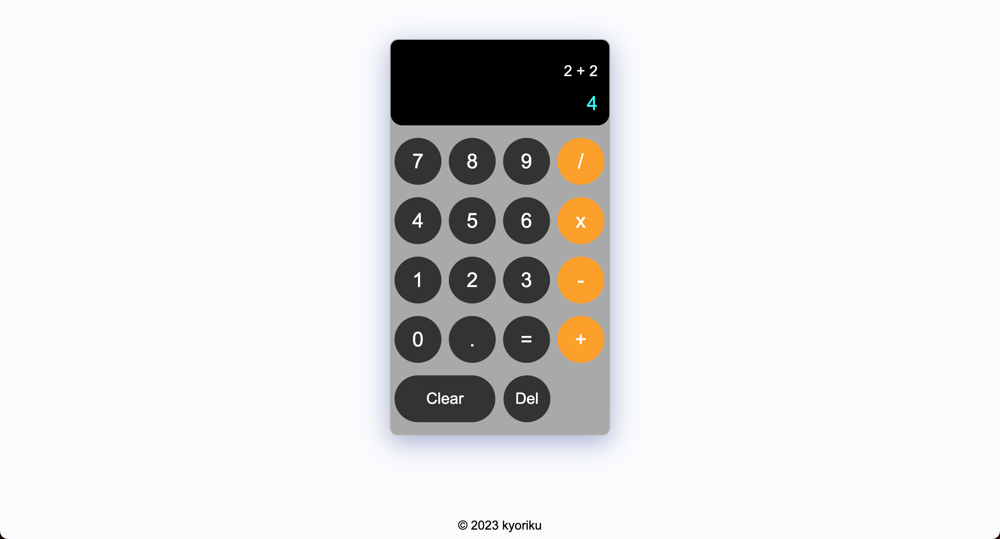

# Calculator
This application is a user-friendly online calculator that allows users to perform basic arithmetic operations, including addition, subtraction, multiplication, and division. It provides a clean and intuitive interface for performing calculations with ease.

This project was developed to offer a convenient and accessible tool for performing common mathematical calculations. It aims to provide a quick and efficient solution for anyone in need of a calculator, whether they are students, professionals, or individuals looking to perform simple math operations without the need for a physical calculator.

The calculator is built using HTML, CSS, and JavaScript, making it accessible through a web browser on various devices. Users can input numbers and operators through a user-friendly interface, and the application utilizes JavaScript functions to evaluate and display the results in real-time. The project also includes error handling to ensure that division by zero or other potential issues are handled gracefully. The calculator allows users to perform calculations, clear the display, and delete the last character for a seamless and efficient user experience.

## Usage
> [Link to deployed applicaton]((https://kyoriku.github.io/calculator/))

## License
Please refer to the LICENSE in the repo.