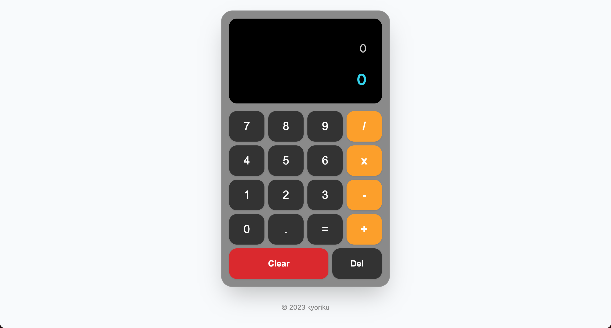

# JavaScript Calculator
*An interactive browser-based calculator application featuring basic arithmetic operations, keyboard support, and secure calculation handling with a clean, intuitive interface*

## Built With
[](https://developer.mozilla.org/en-US/docs/Web/HTML)
[](https://developer.mozilla.org/en-US/docs/Web/CSS)
[](https://developer.mozilla.org/en-US/docs/Web/JavaScript)

## Table of Contents
- [Description](#description)
  - [Deployed Site](#deployed-site)
- [Features](#features)
- [Screenshots](#screenshots)
- [Technical Details](#technical-details)
- [Installation](#installation)
- [Usage](#usage)
- [Contributing](#contributing)
- [License](#license)
- [Questions](#questions)

## Description
This calculator application demonstrates modern JavaScript concepts through an object-oriented approach. Built with vanilla JavaScript, HTML, and CSS, this project showcases class-based architecture, secure computation handling, and responsive design while providing a reliable tool for everyday calculations.

The application combines keyboard support with comprehensive input validation, creating a secure and intuitive calculator experience. The clean interface and robust error handling make it accessible across various devices, whether for quick calculations or more complex arithmetic operations.

### Deployed Site
Visit the live website at [https://kyoriku.github.io/javascript-calculator/](https://kyoriku.github.io/javascript-calculator/)

## Features
* **Secure Arithmetic Operations**
  * Addition, subtraction, multiplication, and division
  * Input sanitization and validation
  * Safe expression evaluation
  * Result rounding to two decimal places

* **Enhanced User Interface**
  * Clean, intuitive design
  * Keyboard support
  * Dual display system
  * Clear visual feedback

* **Input Validation**
  * Prevents invalid operator sequences
  * Handles edge cases securely
  * Clear error messaging
  * Graceful error recovery

* **Input Management**
  * Delete last character functionality
  * Clear all operations
  * Proper operator spacing
  * Continuous calculation support

## Screenshots


## Technical Details
This calculator was built using the following technologies and features:

* **Class Architecture**: Implements object-oriented calculator logic:
   * Constructor: Initializes calculator state, display elements, and operator mapping objects
   * `displays`: Object storing references to calculation and result display elements
   * `operatorDisplayMap`: Handles conversion of operators for display (*, x → ×, / → ÷)
   * `operatorCalculationMap`: Manages conversion of display operators back for calculation

* **Event Handler Initialization**: Implements dynamic event binding:
   * `Array.from`: Generates number button mappings (0-9) programmatically
   * `reduce`: Combines generated button mappings into a single object
   * `Object.entries`: Creates event listener bindings for all buttons
   * `bind`: Ensures proper method context in event callbacks

* **Keyboard Support**: Comprehensive keyboard input handling:
   * `Map`: Implements keyboard input mappings for numbers and operators
   * `preventDefault`: Prevents default browser keyboard actions
   * Case-insensitive key processing
   * Multiple key type support (numbers, operators, control keys)

* **Calculation Processing**: Secure mathematical expression handling:
   * `Function` constructor: Safely evaluates mathematical expressions
   * Input sanitization using regular expressions
   * Operator conversion and validation
   * Result rounding with `Math.round`

* **Input Validation**: Robust input processing system:
   * Regular expressions for operator validation: `/[×÷+\-]/.test()`
   * Prevention of consecutive operators
   * Special case handling for negative numbers
   * Proper operator spacing management

* **String Manipulation**: Advanced calculation string handling:
   * `slice`: Manages character deletion with proper operator spacing
   * `replaceAll`: Handles operator conversion for calculations
   * `trim`: Ensures clean string comparisons
   * Empty string handling with fallback to '0'

## Installation
To run this project locally:

1. Clone the repository
    ```bash
    git clone https://github.com/kyoriku/javascript-calculator.git
    ```
2. Open the `index.html` file in your preferred web browser

## Usage
1. Click number buttons (0-9) to input values
2. Use operator buttons (/, x, -, +) for calculations
3. Press equals (=) to see the result
4. Use "Clear" to reset the calculator
5. Use "Del" to remove the last entered character
6. View your current calculation on the top display with the result shown below it

Keyboard support is also available:
- Numbers: 0-9
- Operators: +, -, *, /
- Enter: Calculate result
- Escape: Clear
- Backspace: Delete last character

## Contributing
Contributions are welcome! Here are ways you can help:

1. Fork the repository
2. Create a feature branch
    ```bash
    git checkout -b feature/YourFeature
    ```
3. Make your changes - this could include:
    * Adding new calculator features
    * Improving the UI/UX
    * Enhancing security measures
    * Optimizing code performance
    * Bug fixes
4. Commit your changes
5. Push to your branch
6. Open a Pull Request

Please ensure your contributions:
* Follow the existing code style
* Include appropriate error handling
* Test all changes locally
* Include clear descriptions in your pull request

## License
[](https://opensource.org/licenses/MIT)

This project is licensed under the [MIT](https://opensource.org/licenses/MIT) license - see the LICENSE file for details.

## Questions
For any questions, feel free to email me at devkyoriku@gmail.com.